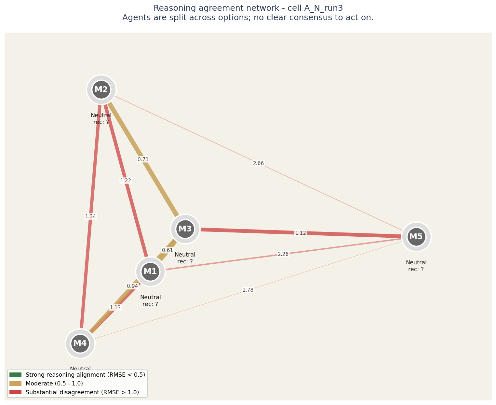
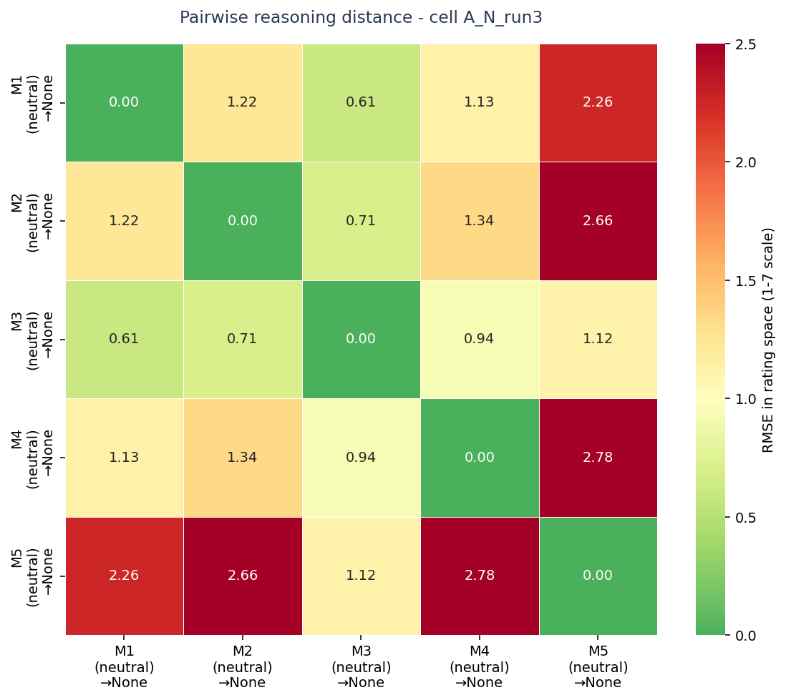
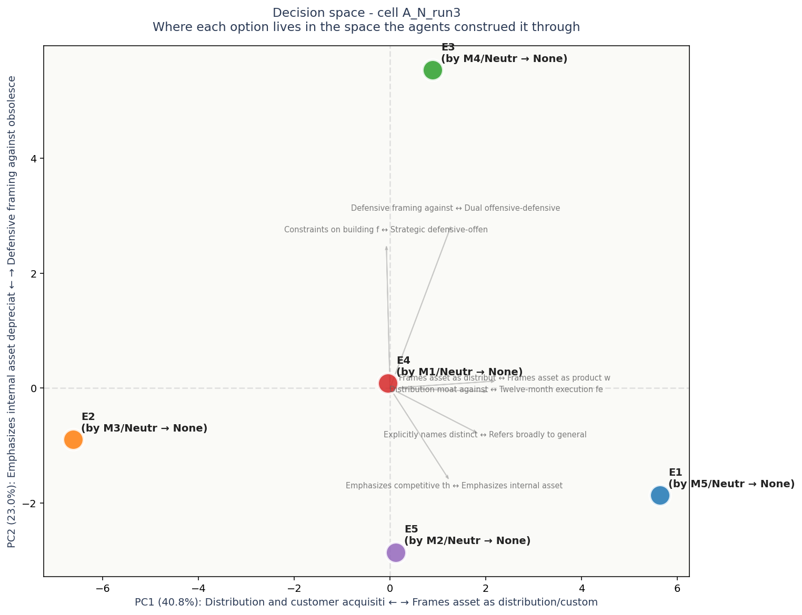

# Multi-Agent Decision Audit

**Audit subject:** `A_N_run3`
**Task domain:** A
**Configuration:** neutral, run 3
**Date generated:** see `operator_insight.json`

---

## Severity: INFO

> Agents are split; standard aggregation would average over genuine disagreement.

## Headline

Agents are split across options; no clear consensus to act on.

## Reasoning agreement network



## How to read this network

Each circle is an LLM agent in the panel. Position on the canvas reflects how similarly the agent rated all the elements: agents close together reason about the decision in similar ways, agents far apart reason differently.

The lines between circles encode reasoning agreement. Green-and-thick = the two agents reason almost identically. Yellow-medium = they differ on framing. Red-thin = substantial disagreement at the reasoning level even if their final recommendations might match.

Inside each circle is the agent label and its epistemological frame (Quantitative, Systems, Engineering, Humanist, Contrarian). The halo color around each circle indicates which option that agent recommended.

For this case: **Agents are split across options; no clear consensus to act on.**

**Operator note:** halos show different recommendations - the panel is split. The network helps you see WHICH agents reason alike and which don't, which is more useful than counting votes.


## Cross-cell context

This case sits in the broader experimental landscape:


## Metrics

| Metric | Value | Interpretation |
|--------|-------|----------------|
| Agents in ensemble | 5 | Number of models that produced recommendations |
| Distinct recommendations | 0 | Output-level diversity |
| Consensus strength | `split` | strong=4-5 agree; partial=3; split=<3 |
| Reasoning diversity (RMSE in rating space) | 0.000 | 0 = identical reasoning, 2+ = substantially different |
| Blind-spot constructs | 1 | Dimensions where all options scored mid-scale (4 +/- 1) |

## Pairwise reasoning distance heatmap



## How to read this heatmap

Each cell shows the reasoning distance between two agents. Values are in RMSE (root-mean-square error) on the 1-7 Likert rating scale. Roughly: 0.0-0.5 = aligned reasoning, 0.5-1.0 = moderate differences, 1.0-2.0 = substantial differences, 2.0+ = very different framings.

Read along a row or column to see how that agent's reasoning compares to each other agent. Hot spots (red) mark pairs that reason differently even if they may have reached the same recommendation.

Each label shows: agent ID, epistemological frame in parentheses, and the option that agent recommended (→).


## Recommendations distribution

```
  (no parsed recommendations)
```

)


## Agent fingerprints

| Agent | Persona | Recommendation | Model |
|---|---|---|---|
| M1 | neutral | — | `anthropic/claude-opus-4.7` |
| M2 | neutral | — | `openai/gpt-5.5` |
| M3 | neutral | — | `google/gemini-3.1-pro-preview` |
| M4 | neutral | — | `deepseek/deepseek-v4-pro` |
| M5 | neutral | — | `moonshotai/kimi-k2.6` |

## Decision space (PCA biplot)



## How to read this decision-space map

Each colored dot is one of the 5 options under consideration, positioned in a 2D space derived from how all the agents rated all the constructs. Options close together were seen similarly by the panel; options far apart were seen as fundamentally different kinds of choices.

The axes are interpretable. The horizontal axis (PC1) is dominated by **Distribution and customer acquisition advantage** on one end and **Frames asset as distribution/customer base (E2, E5** on the other - this is the single biggest dimension along which the options differ. The vertical axis (PC2) is dominated by **Emphasizes internal asset depreciation risk (E4)** vs **Defensive framing against obsolescence (E2, E5)**.

Gray arrows show which construct dimensions point in which direction. If two options are far apart along one arrow, the construct that arrow represents is what makes them feel different. If an arrow is short, that construct does not strongly differentiate the options.

Each label shows: option ID, the agent who authored that response, their epistemological frame, and the option they recommended.


## Hidden disagreement detail

Status: no_majority. Agents split across recommendations; no hidden-consensus to expose.

## Risk surface (minority concerns)

- **M1**: highest: the core product
- **M3**: into a powerful retention mechanism—and likely a premium tier upsell
- **M4**: attrition and squanders the team’s domain expertise
- **M5**: not that the firm fails to invent a second product, but that its flagship becomes obsolete

## Operator action items

1. All options scored near the middle on the axis 'Focuses on user UX and product feel' vs 'Focuses on go-to-market and distribution advantages'. Does any option deserve a strong position here? If not, is this a dimension being underweighted?

---

## How to use this audit in your pipeline

```python
from archipelago_audit import AuditResult
result = AuditResult.load("operator_outputs/A_N_run3/operator_insight.json")
if result.severity == "HIGH":
    # block deployment, route to human review
    raise EnsembleConvergenceAlert(result.headline)
elif result.severity == "MEDIUM":
    # log but continue
    logger.warning(result.headline)
```
