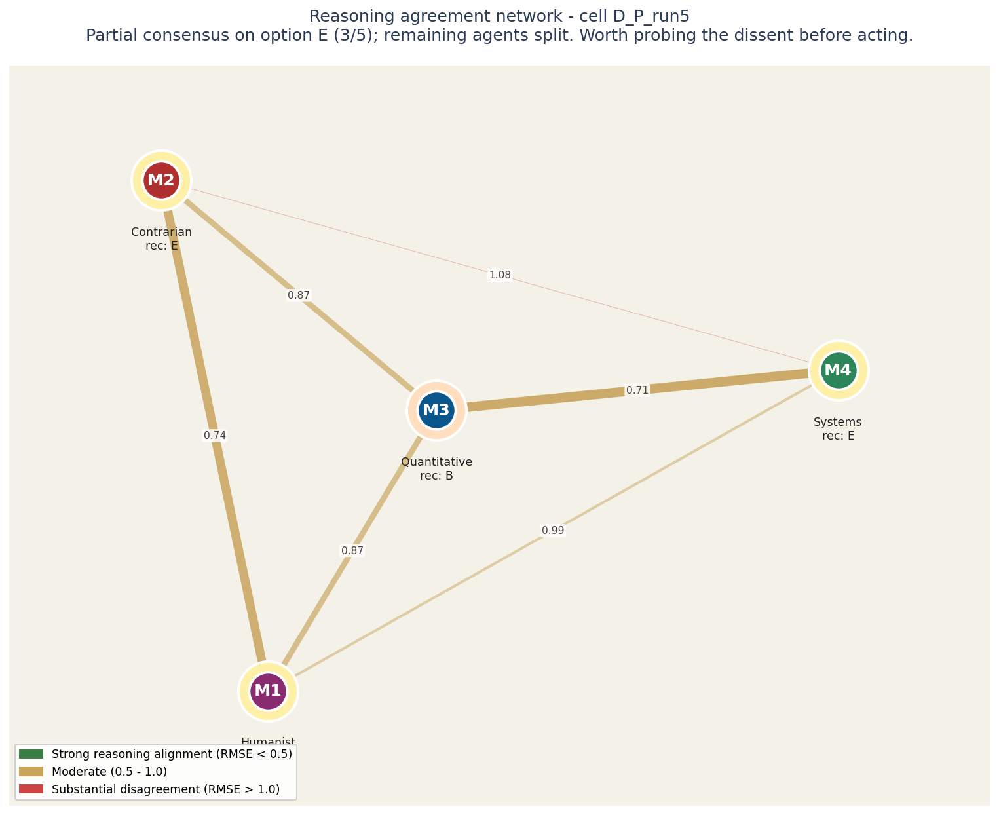
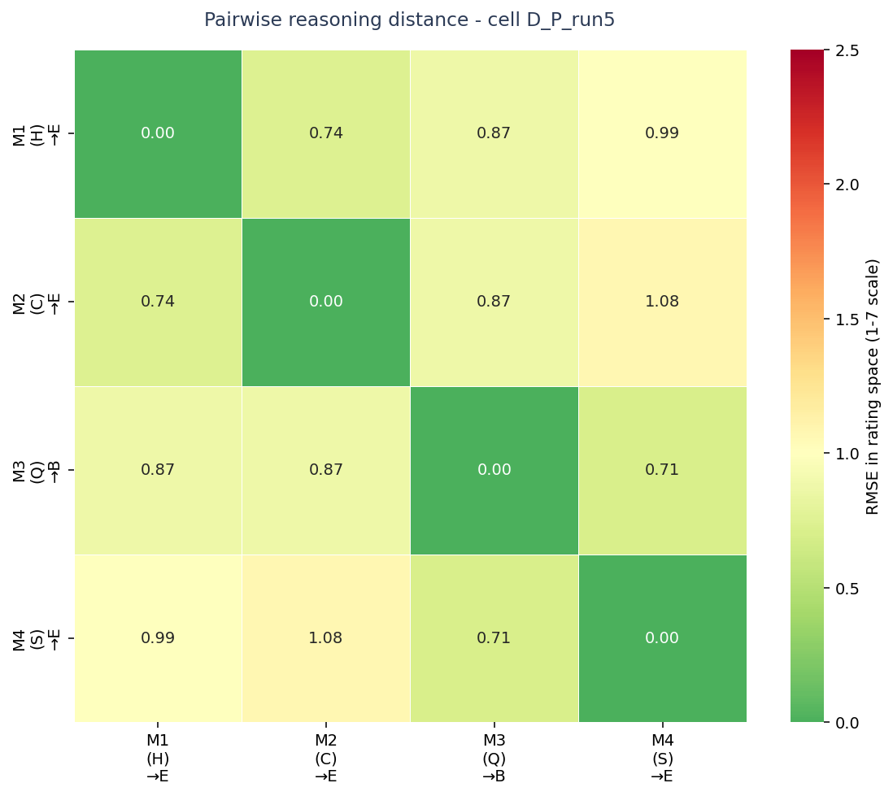
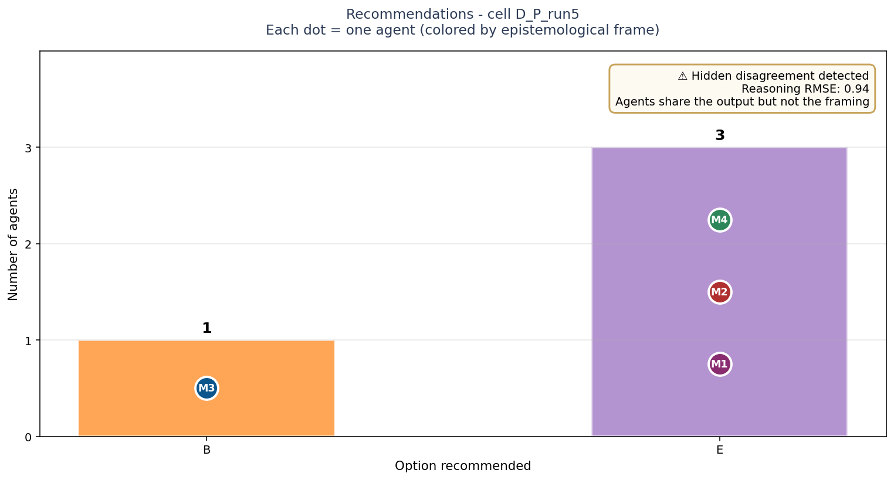
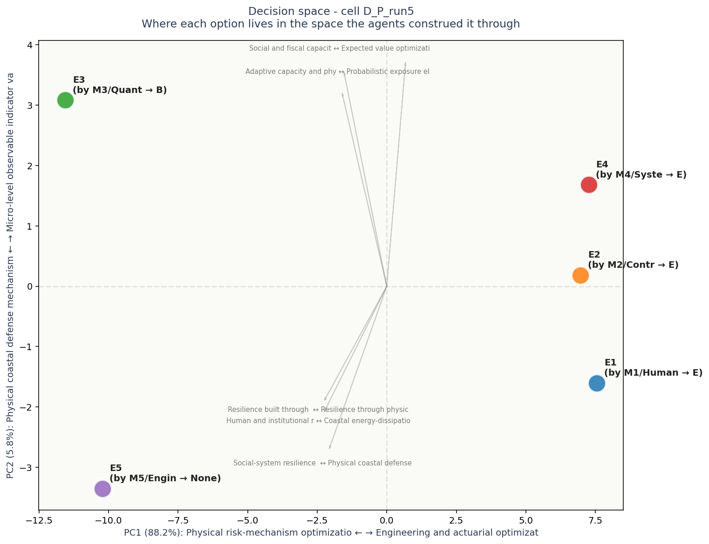

# Multi-Agent Decision Audit

**Audit subject:** `D_P_run5`
**Task domain:** D
**Configuration:** persona, run 5
**Date generated:** see `operator_insight.json`

---

## Severity: MEDIUM

> Partial consensus; dissenting voices may carry information lost to majority aggregation.

## Headline

Partial consensus on option E (3/5); remaining agents split. Worth probing the dissent before acting.

## Reasoning agreement network



## How to read this network

Each circle is an LLM agent in the panel. Position on the canvas reflects how similarly the agent rated all the elements: agents close together reason about the decision in similar ways, agents far apart reason differently.

The lines between circles encode reasoning agreement. Green-and-thick = the two agents reason almost identically. Yellow-medium = they differ on framing. Red-thin = substantial disagreement at the reasoning level even if their final recommendations might match.

Inside each circle is the agent label and its epistemological frame (Quantitative, Systems, Engineering, Humanist, Contrarian). The halo color around each circle indicates which option that agent recommended.

For this case: **Partial consensus on option E (3/5); remaining agents split. Worth probing the dissent before acting.**

**Operator note:** both halos and network edges suggest aligned thinking. The consensus appears robust.


## Cross-cell context

This case sits in the broader experimental landscape:


## Metrics

| Metric | Value | Interpretation |
|--------|-------|----------------|
| Agents in ensemble | 5 | Number of models that produced recommendations |
| Distinct recommendations | 2 | Output-level diversity |
| Consensus strength | `partial` | strong=4-5 agree; partial=3; split=<3 |
| Reasoning diversity (RMSE in rating space) | 0.936 | 0 = identical reasoning, 2+ = substantially different |
| Blind-spot constructs | 0 | Dimensions where all options scored mid-scale (4 +/- 1) |

## Pairwise reasoning distance heatmap



## How to read this heatmap

Each cell shows the reasoning distance between two agents. Values are in RMSE (root-mean-square error) on the 1-7 Likert rating scale. Roughly: 0.0-0.5 = aligned reasoning, 0.5-1.0 = moderate differences, 1.0-2.0 = substantial differences, 2.0+ = very different framings.

Read along a row or column to see how that agent's reasoning compares to each other agent. Hot spots (red) mark pairs that reason differently even if they may have reached the same recommendation.

Each label shows: agent ID, epistemological frame in parentheses, and the option that agent recommended (→).


## Recommendations distribution

```
  Option B: # (1)
  Option E: ### (3)
```



## How to read this chart

Bars show how many agents recommended each option. Each bar is annotated with the individual agents who supported it, color-coded by epistemological frame.

**The key signal is in the corner box.** A check-mark means the panel's agreement runs deep - they share both the recommendation and the reasoning. A warning means they share the recommendation but not the underlying logic; this is the configuration most likely to produce execution surprises.


## Agent fingerprints

| Agent | Persona | Recommendation | Model |
|---|---|---|---|
| M1 | H | E | `anthropic/claude-opus-4.7` |
| M2 | C | E | `openai/gpt-5.5` |
| M3 | Q | B | `google/gemini-3.1-pro-preview` |
| M4 | S | E | `deepseek/deepseek-v4-pro` |
| M5 | E | — | `moonshotai/kimi-k2.6` |

## Decision space (PCA biplot)



## How to read this decision-space map

Each colored dot is one of the 5 options under consideration, positioned in a 2D space derived from how all the agents rated all the constructs. Options close together were seen similarly by the panel; options far apart were seen as fundamentally different kinds of choices.

The axes are interpretable. The horizontal axis (PC1) is dominated by **Physical risk-mechanism optimization lens** on one end and **Engineering and actuarial optimization** on the other - this is the single biggest dimension along which the options differ. The vertical axis (PC2) is dominated by **Physical coastal defense mechanism** vs **Micro-level observable indicator variables**.

Gray arrows show which construct dimensions point in which direction. If two options are far apart along one arrow, the construct that arrow represents is what makes them feel different. If an arrow is short, that construct does not strongly differentiate the options.

Each label shows: option ID, the agent who authored that response, their epistemological frame, and the option they recommended.


## Hidden disagreement detail

- **Reasoning diversity score:** 0.936
- **Agents in majority consensus:** M1, M2, M4
- **Max pairwise RMSE:** 1.076

Moderate hidden disagreement: 3 agents recommended option E but differ on framing (mean RMSE = 0.94). Worth probing what each is emphasizing.

## Risk surface (minority concerns)

- **M2**: become clearer, unlike a seawall that locks the country into defending yesterday’s settlement pattern; becoming an expensive promise that the coastline can be held in place
- **M3**: climate models; can be tracked month-to-month and managed via dynamic pricing incentives, whereas physical infrastructure failure is an unmanageable step-function
- **M4**: a second-order effect of creating a displaced, disenfranchised population whose social capital is destroyed, creating a new, more profound vulnerability; to avoid a far greater systemic one: a society with strong walls but a hollowed-out core, unable to weather the storms of the next 15 years

## Operator action items

1. Agents M1 (H), M2 (C), M4 (S) agreed on option E - but their reasoning differs (diversity=0.94). Which framing will drive execution? Different framings will produce different execution paths.
2. Option B was recommended only by M3 (Q). What does this agent see that others missed - or what is it weighing differently?

---

## How to use this audit in your pipeline

```python
from archipelago_audit import AuditResult
result = AuditResult.load("operator_outputs/D_P_run5/operator_insight.json")
if result.severity == "HIGH":
    # block deployment, route to human review
    raise EnsembleConvergenceAlert(result.headline)
elif result.severity == "MEDIUM":
    # log but continue
    logger.warning(result.headline)
```
