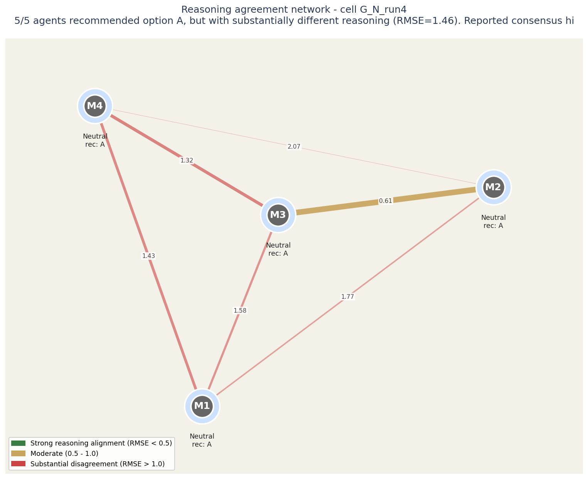
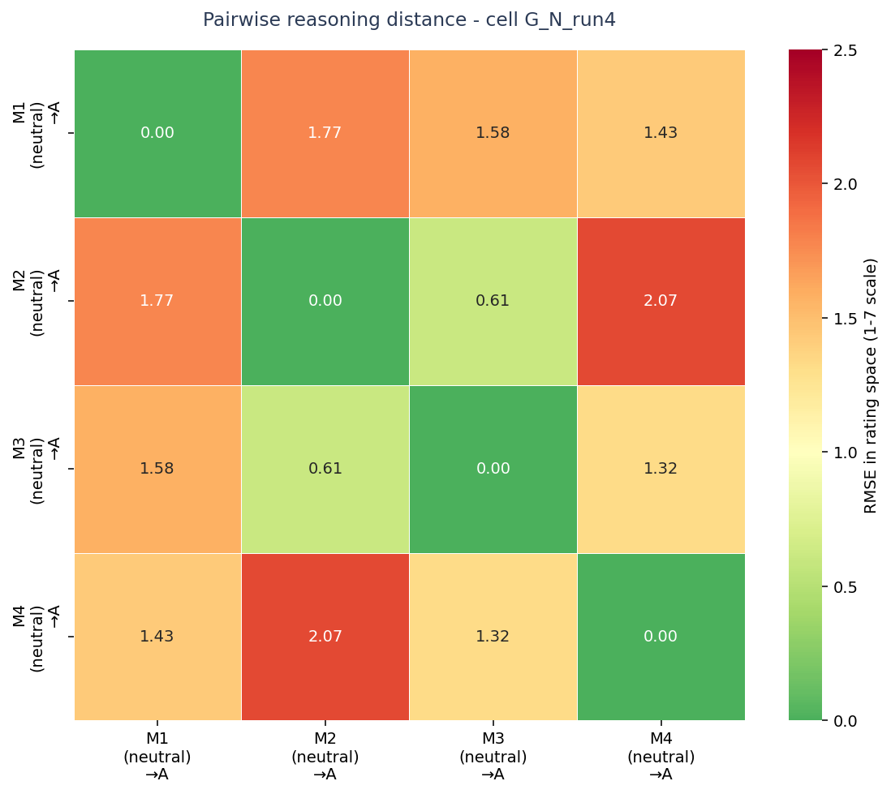
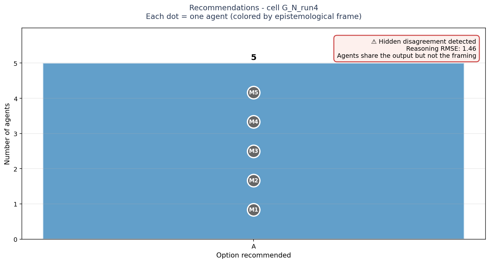
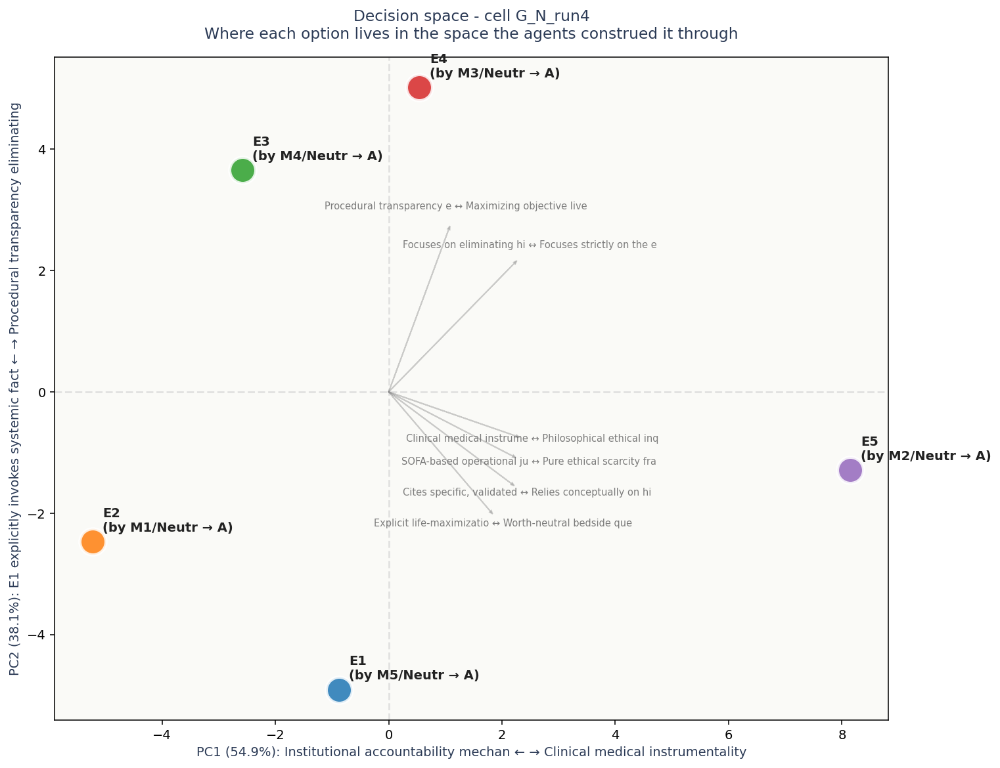

# Multi-Agent Decision Audit

**Audit subject:** `G_N_run4`
**Task domain:** G
**Configuration:** neutral, run 4
**Date generated:** see `operator_insight.json`

---

## Severity: HIGH

> Strong reported consensus hides substantial reasoning-level disagreement (RMSE=1.46).

## Headline

5/5 agents recommended option A, but with substantially different reasoning (RMSE=1.46). Reported consensus hides actionable disagreement.

## Reasoning agreement network



## How to read this network

Each circle is an LLM agent in the panel. Position on the canvas reflects how similarly the agent rated all the elements: agents close together reason about the decision in similar ways, agents far apart reason differently.

The lines between circles encode reasoning agreement. Green-and-thick = the two agents reason almost identically. Yellow-medium = they differ on framing. Red-thin = substantial disagreement at the reasoning level even if their final recommendations might match.

Inside each circle is the agent label and its epistemological frame (Quantitative, Systems, Engineering, Humanist, Contrarian). The halo color around each circle indicates which option that agent recommended.

For this case: **5/5 agents recommended option A, but with substantially different reasoning (RMSE=1.46). Reported consensus hides actionable disagreement.**

**Operator note:** the recommendation halos look unified (most agents chose the same option), but the network edges reveal underlying reasoning differences. Standard aggregation would miss this. Probe the framings before committing to execution.


## Cross-cell context

This case sits in the broader experimental landscape:


## Metrics

| Metric | Value | Interpretation |
|--------|-------|----------------|
| Agents in ensemble | 5 | Number of models that produced recommendations |
| Distinct recommendations | 1 | Output-level diversity |
| Consensus strength | `strong` | strong=4-5 agree; partial=3; split=<3 |
| Reasoning diversity (RMSE in rating space) | 1.464 | 0 = identical reasoning, 2+ = substantially different |
| Blind-spot constructs | 1 | Dimensions where all options scored mid-scale (4 +/- 1) |

## Pairwise reasoning distance heatmap



## How to read this heatmap

Each cell shows the reasoning distance between two agents. Values are in RMSE (root-mean-square error) on the 1-7 Likert rating scale. Roughly: 0.0-0.5 = aligned reasoning, 0.5-1.0 = moderate differences, 1.0-2.0 = substantial differences, 2.0+ = very different framings.

Read along a row or column to see how that agent's reasoning compares to each other agent. Hot spots (red) mark pairs that reason differently even if they may have reached the same recommendation.

Each label shows: agent ID, epistemological frame in parentheses, and the option that agent recommended (→).


## Recommendations distribution

```
  Option A: ##### (5)
```



## How to read this chart

Bars show how many agents recommended each option. Each bar is annotated with the individual agents who supported it, color-coded by epistemological frame.

**The key signal is in the corner box.** A check-mark means the panel's agreement runs deep - they share both the recommendation and the reasoning. A warning means they share the recommendation but not the underlying logic; this is the configuration most likely to produce execution surprises.


## Agent fingerprints

| Agent | Persona | Recommendation | Model |
|---|---|---|---|
| M1 | neutral | A | `anthropic/claude-opus-4.7` |
| M2 | neutral | A | `openai/gpt-5.5` |
| M3 | neutral | A | `google/gemini-3.1-pro-preview` |
| M4 | neutral | A | `deepseek/deepseek-v4-pro` |
| M5 | neutral | A | `moonshotai/kimi-k2.6` |

## Decision space (PCA biplot)



## How to read this decision-space map

Each colored dot is one of the 5 options under consideration, positioned in a 2D space derived from how all the agents rated all the constructs. Options close together were seen similarly by the panel; options far apart were seen as fundamentally different kinds of choices.

The axes are interpretable. The horizontal axis (PC1) is dominated by **Institutional accountability mechanisms** on one end and **Clinical medical instrumentality** on the other - this is the single biggest dimension along which the options differ. The vertical axis (PC2) is dominated by **E1 explicitly invokes systemic factors (trust, hid** vs **Procedural transparency eliminating hidden discret**.

Gray arrows show which construct dimensions point in which direction. If two options are far apart along one arrow, the construct that arrow represents is what makes them feel different. If an arrow is short, that construct does not strongly differentiate the options.

Each label shows: option ID, the agent who authored that response, their epistemological frame, and the option they recommended.


## Hidden disagreement detail

- **Reasoning diversity score:** 1.464
- **Agents in majority consensus:** M1, M2, M3, M4, M5
- **Max pairwise RMSE:** 2.067

FLAG: 5 agents recommended option A, but their underlying reasoning differs substantially (mean RMSE in rating space = 1.46 on a 1-7 scale). Standard ensemble aggregation would report 'strong consensus' here; this is hidden disagreement that may surface as execution conflicts.

## Risk surface (minority concerns)

- **M2**: appearing to devalue disability
- **M3**: intense backlash from disability advocates

## Operator action items

1. Agents M1 (neutral), M2 (neutral), M3 (neutral), M4 (neutral), M5 (neutral) agreed on option A - but their reasoning differs (diversity=1.46). Which framing will drive execution? Different framings will produce different execution paths.
2. All options scored near the middle on the axis 'References systemic context of the decision-making environment.' vs 'E2 and E3 are anchored in protocol details and tool specificity, while E1 emphasizes the breakdown of institutional trust.'. Does any option deserve a strong position here? If not, is this a dimension being underweighted?
3. Consensus is strong (4-5 agents agree). Is this because the answer is genuinely obvious, or because agents share a common training distribution? If you cannot articulate why the OTHER options were rejected, the consensus may be inherited, not earned.

---

## How to use this audit in your pipeline

```python
from archipelago_audit import AuditResult
result = AuditResult.load("operator_outputs/G_N_run4/operator_insight.json")
if result.severity == "HIGH":
    # block deployment, route to human review
    raise EnsembleConvergenceAlert(result.headline)
elif result.severity == "MEDIUM":
    # log but continue
    logger.warning(result.headline)
```
