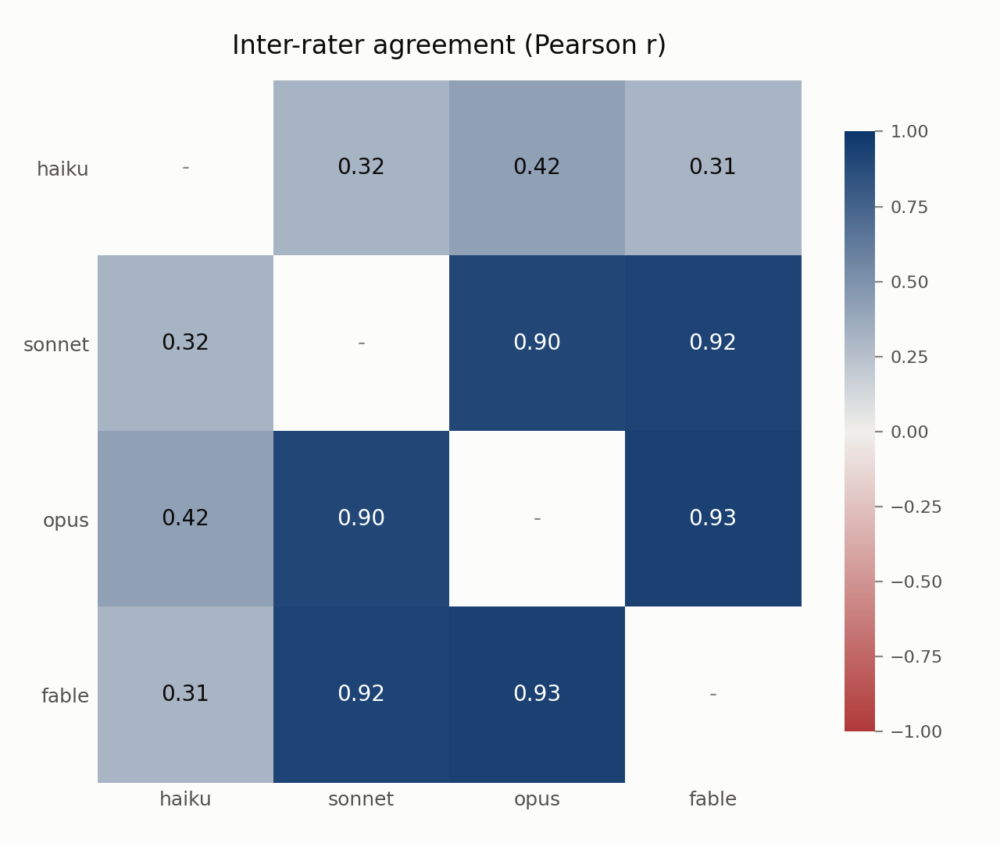
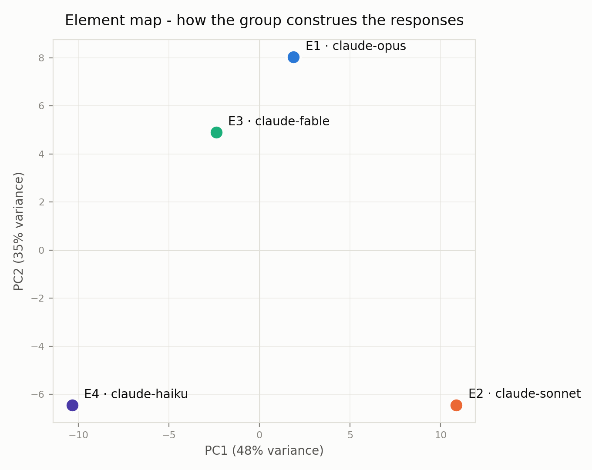

# CM-RG mini-grid report (stub - fill narrative sections)

Models: claude-opus, claude-sonnet, claude-fable, claude-haiku
Constructs: 47 | Ratings: 752 | Null cells: 0
Mean pairwise r: 0.633
Calibration: {'claude-haiku': 3.926, 'claude-sonnet': 3.899, 'claude-opus': 3.617, 'claude-fable': 3.654}
Most contested element: E2

