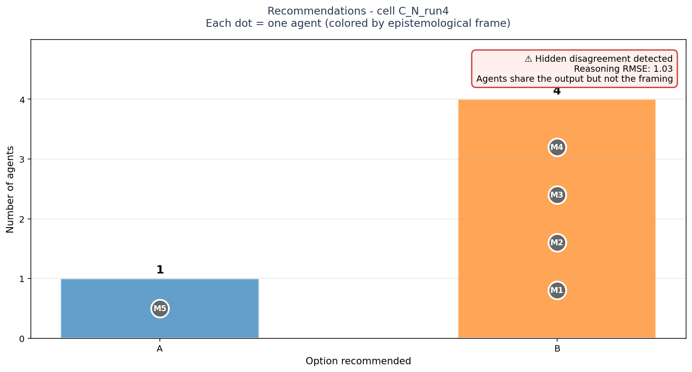
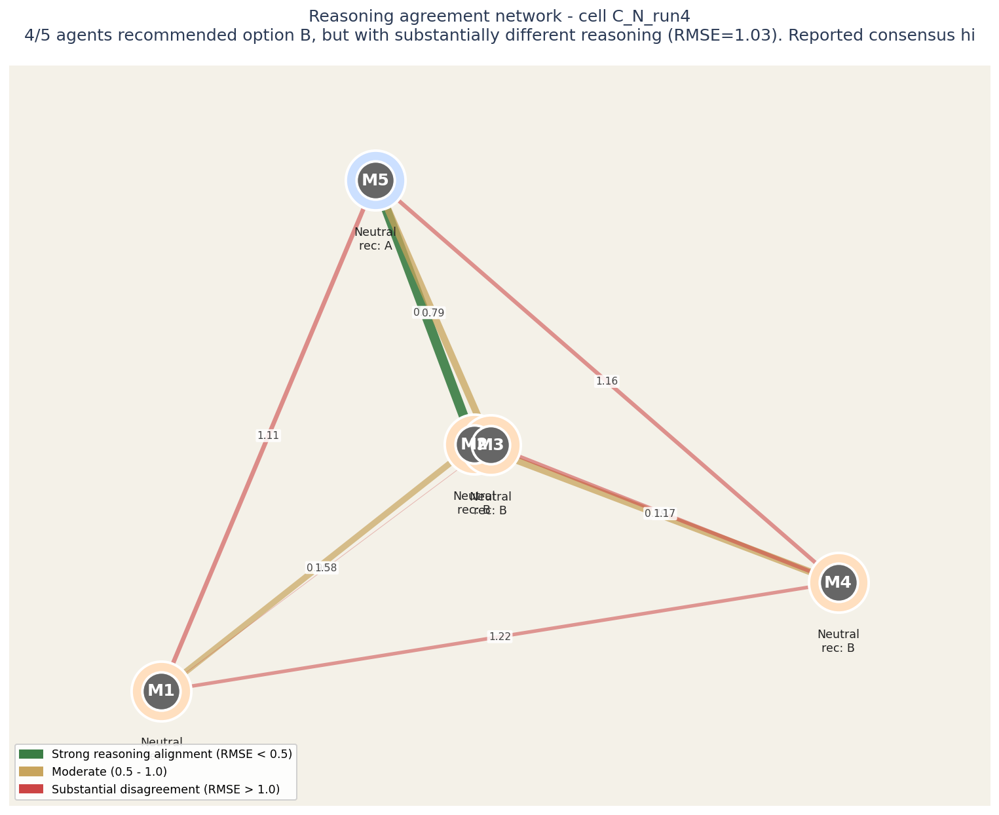

# Strategic AI Council Briefing

**Case identifier:** C_N_run4
**Decision domain:** C
**Analysis configuration:** neutral framing
**Date:** generated from operator_insight.json

---

## Executive summary

4/5 agents recommended option B, but with substantially different reasoning (RMSE=1.03). Reported consensus hides actionable disagreement.

**Recommendation strength:** STRONG.
**Reasoning alignment:** low.

The five voices reached strong consensus on Option B, but their reasoning differs substantially. This is the configuration most likely to produce execution surprises: the recommendation is shared, the path to it is not.

---

## 1. What the AI Council recommends

Five frontier AI models, each operating under a distinct epistemological frame, analyzed this decision independently. Their recommendations:

| Option | Voices in favor | Source frames |
|---|---|---|
| **Option A** | 1 of 5 | M5/neutral |
| **Option B** | 4 of 5 | M1/neutral, M2/neutral, M3/neutral, M4/neutral |

The AI Council reached strong consensus on **Option B** (4 of 5 voices). Standard ensemble methods would report this as a confident recommendation. The next section examines whether this confidence is warranted.

## How to read this chart

Bars show how many agents recommended each option. Each bar is annotated with the individual agents who supported it, color-coded by epistemological frame.

**The key signal is in the corner box.** A check-mark means the panel's agreement runs deep - they share both the recommendation and the reasoning. A warning means they share the recommendation but not the underlying logic; this is the configuration most likely to produce execution surprises.

## 2. The hidden disagreement check

The most consequential finding in any multi-perspective analysis is not where the experts disagreed - it is where they appeared to agree but did so for incompatible reasons.

## How to read this network

Each circle is an LLM agent in the panel. Position on the canvas reflects how similarly the agent rated all the elements: agents close together reason about the decision in similar ways, agents far apart reason differently.

The lines between circles encode reasoning agreement. Green-and-thick = the two agents reason almost identically. Yellow-medium = they differ on framing. Red-thin = substantial disagreement at the reasoning level even if their final recommendations might match.

Inside each circle is the agent label and its epistemological frame (Quantitative, Systems, Engineering, Humanist, Contrarian). The halo color around each circle indicates which option that agent recommended.

For this case: **4/5 agents recommended option B, but with substantially different reasoning (RMSE=1.03). Reported consensus hides actionable disagreement.**

**Operator note:** the recommendation halos look unified (most agents chose the same option), but the network edges reveal underlying reasoning differences. Standard aggregation would miss this. Probe the framings before committing to execution.

FLAG: 4 agents recommended option B, but their underlying reasoning differs substantially (mean RMSE in rating space = 1.03 on a 1-7 scale). Standard ensemble aggregation would report 'strong consensus' here; this is hidden disagreement that may surface as execution conflicts.

> **Implication for execution:** if you proceed with this recommendation, the framing that drives it will matter. Different framings produce different execution paths, different metrics, and different definitions of success. Make explicit which framing your team is operating from before committing resources.

## 3. What no one weighted enough

The analysis surfaced dimensions of this decision that all five voices treated as middling - neither strongly for nor strongly against.

_The analysis did not surface obvious blind spots. The voices collectively explored the relevant dimensions of this decision._

## 4. Risks raised by minority voices

Risks that consensus aggregation tends to dilute, but that minority voices flagged:

- **neutral frame (M1):** from training artifacts, and a permanent narrative vulnerability ("they train on your health data, but you can opt out")
- **neutral frame (M3):** model memorization
- **neutral frame (M4):** unreliable performance and delays
- **neutral frame (M5):** model; Option B eliminates the risk structurally

## 5. Questions for your leadership team

The following questions are designed to surface what the AI Council could not resolve on its own - they require your team's judgment, your organizational context, and your accountability:

**Q1.** Agents M1 (neutral), M2 (neutral), M3 (neutral), M4 (neutral) agreed on option B - but their reasoning differs (diversity=1.03). Which framing will drive execution? Different framings will produce different execution paths.

**Q2.** Option A was recommended only by M5 (neutral). What does this agent see that others missed - or what is it weighing differently?

**Q3.** Consensus is strong (4-5 agents agree). Is this because the answer is genuinely obvious, or because agents share a common training distribution? If you cannot articulate why the OTHER options were rejected, the consensus may be inherited, not earned.

---

## Methodology note

This briefing was produced using the Archipelago method - a structured procedure derived from personal construct theory (Kelly, 1955) applied to multi-agent LLM analysis. The method does not aim to give you "the right answer." It aims to give you a legible map of where reasonable analyses would diverge and why, so your team can decide with eyes open.

The five voices are: Q (quantitative-empirical), S (systems-strategic), E (engineering-fundamentals), H (humanist-ethical), C (contrarian-skeptical). Each voice was provided by a different frontier model family to control for shared training distribution.

---

*This briefing is decision support, not decision substitution. The reasoning, judgment, and accountability remain with you.*
