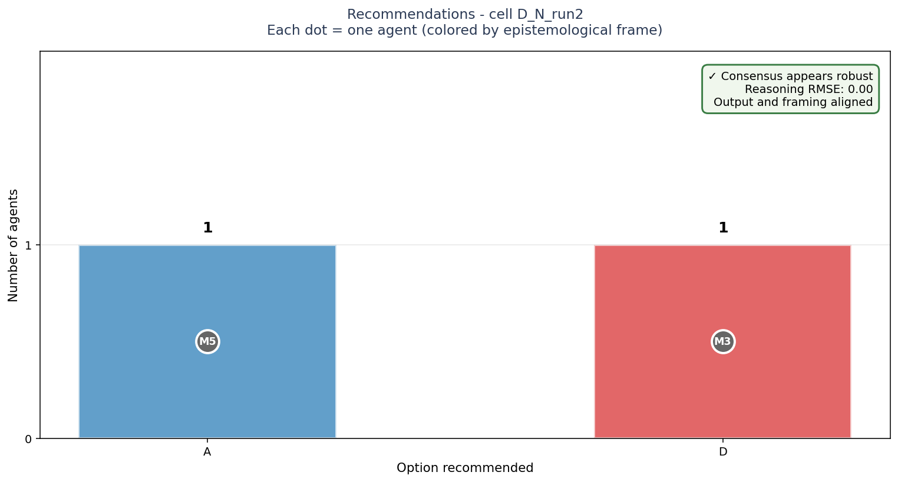
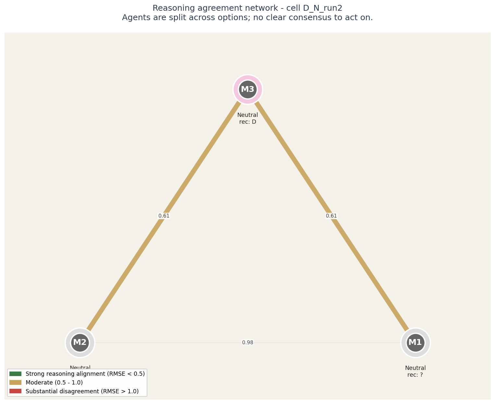

# Strategic AI Council Briefing

**Case identifier:** D_N_run2
**Decision domain:** D
**Analysis configuration:** neutral framing
**Date:** generated from operator_insight.json

---

## Executive summary

Agents are split across options; no clear consensus to act on.

**Recommendation strength:** SPLIT.
**Reasoning alignment:** high.

The five voices did not converge. Each saw a different option as most appropriate, and their disagreement reflects genuine value tradeoffs rather than analytical error. Your team's judgment matters more here than the AI Council's.

---

## 1. What the AI Council recommends

Five frontier AI models, each operating under a distinct epistemological frame, analyzed this decision independently. Their recommendations:

| Option | Voices in favor | Source frames |
|---|---|---|
| **Option A** | 1 of 5 | M5/neutral |
| **Option D** | 1 of 5 | M3/neutral |

The AI Council was split across options. No standard aggregation method will produce a confident recommendation here. The value of this analysis is in the structure of the disagreement, not in averaging it away.

## How to read this chart

Bars show how many agents recommended each option. Each bar is annotated with the individual agents who supported it, color-coded by epistemological frame.

**The key signal is in the corner box.** A check-mark means the panel's agreement runs deep - they share both the recommendation and the reasoning. A warning means they share the recommendation but not the underlying logic; this is the configuration most likely to produce execution surprises.

## 2. The hidden disagreement check

The most consequential finding in any multi-perspective analysis is not where the experts disagreed - it is where they appeared to agree but did so for incompatible reasons.

## How to read this network

Each circle is an LLM agent in the panel. Position on the canvas reflects how similarly the agent rated all the elements: agents close together reason about the decision in similar ways, agents far apart reason differently.

The lines between circles encode reasoning agreement. Green-and-thick = the two agents reason almost identically. Yellow-medium = they differ on framing. Red-thin = substantial disagreement at the reasoning level even if their final recommendations might match.

Inside each circle is the agent label and its epistemological frame (Quantitative, Systems, Engineering, Humanist, Contrarian). The halo color around each circle indicates which option that agent recommended.

For this case: **Agents are split across options; no clear consensus to act on.**

**Operator note:** halos show different recommendations - the panel is split. The network helps you see WHICH agents reason alike and which don't, which is more useful than counting votes.

_Hidden disagreement analysis was not applicable to this case._

## 3. What no one weighted enough

The analysis surfaced dimensions of this decision that all five voices treated as middling - neither strongly for nor strongly against.

_The analysis did not surface obvious blind spots. The voices collectively explored the relevant dimensions of this decision._

## 4. Risks raised by minority voices

Risks that consensus aggregation tends to dilute, but that minority voices flagged:

- **neutral frame (M2):** not a single storm or a single vulnerable asset; it is the growing concentration of people, infrastructure, and fiscal liability in places that will become progressively harder to defend; creating a false sense of security and locking the country into defending today’s settlement patterns against tomorrow’s climate

## 5. Questions for your leadership team

The following questions are designed to surface what the AI Council could not resolve on its own - they require your team's judgment, your organizational context, and your accountability:

**Q1.** Option D was recommended only by M3 (neutral). What does this agent see that others missed - or what is it weighing differently?

**Q2.** Option A was recommended only by M5 (neutral). What does this agent see that others missed - or what is it weighing differently?

---

## Methodology note

This briefing was produced using the Archipelago method - a structured procedure derived from personal construct theory (Kelly, 1955) applied to multi-agent LLM analysis. The method does not aim to give you "the right answer." It aims to give you a legible map of where reasonable analyses would diverge and why, so your team can decide with eyes open.

The five voices are: Q (quantitative-empirical), S (systems-strategic), E (engineering-fundamentals), H (humanist-ethical), C (contrarian-skeptical). Each voice was provided by a different frontier model family to control for shared training distribution.

---

*This briefing is decision support, not decision substitution. The reasoning, judgment, and accountability remain with you.*
