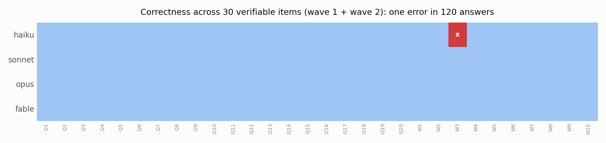

# Reliability pilot: does a diverse panel give a more reliable answer?

*Archipelago / CM-RG side experiment, 2026-07-21. Pre-registered
(`EXPERIMENT_PROTOCOL.md`), deviations documented (`DEVIATIONS.md`), every
number reproducible from `responses.json` + `score.py`.*

## Setup

30 freshly generated computational items with code-computed ground truth
(wave 1: 20 items; wave 2: 10 substantially harder items - exact 6x6-digit
multiplication, a 118-step Collatz trace, digit sum of 3^50, constrained
counting). Four Claude-family models (haiku, sonnet, opus, fable) answered
every item independently, no tools. Panels composed post-hoc from the same
answers: Panel D (diverse: haiku+fable+sonnet, mean pairwise r = 0.51 on the
CM-RG grid) vs Panel R (redundant bloc: opus+fable+sonnet, mean r = 0.92),
majority vote. Arm 2: fable x 3 personas vs fable x 3 neutral runs (capability
held constant).

## Results

| Condition | Accuracy |
|---|---|
| haiku (single) | 29/30 |
| sonnet, opus, fable (singles) | 30/30 each |
| Panel D (diverse) - majority | 30/30 |
| Panel R (redundant) - majority | 30/30 |
| fable personas Q/S/C (each and majority) | 10/10 |
| fable neutral x3 (each and majority) | 10/10 |

**One error in 120 single answers.** haiku miscomputed 3^50 (digit sum 119 vs
144) - the only item where the pool split. All six fable runs (3 personas + 3
neutral) produced byte-identical answers.

## Verdict on the hypotheses

**H-A (diverse vs redundant panel): tie at ceiling - uninformative.** Both
panels scored 30/30. The pre-registered prediction (R >= D) was technically
met, but the test says nothing about diversity because there were almost no
errors to correct.

**H-B (persona diversity, capability-controlled): null, as predicted.**
Personas did not change a single answer on computational items. Prompt-level
diversity that visibly reshapes judgment tasks (Archipelago Phase 2K) has
zero effect here. Diversity is domain-specific.

**H-C (convergence predicts correctness): directionally confirmed, n too
small.** 29/29 converged items were correct; the single split item flagged
the only individual error in the whole experiment (the majority still
recovered it). Precision of the "split = something is wrong" signal: 1/1.
That is exactly the predicted behavior - on a sample too small to claim the
pre-registered 20-point criterion.

**Unplanned validation (D3): the convergence signal audits gold answers.**
During wave 2, all four models unanimously answered 133 on the grid-squares
item while the generator's "ground truth" said 85. The unanimity triggered an
audit; a brute-force enumeration proved the generator had an off-by-one bug.
The panel corrected the benchmark, not the other way around. Practical rule:
when a unanimous cross-bloc panel disagrees with your reference answer,
audit the reference.

## What this actually establishes

1. **The 2026 Claude family is at ceiling on no-tool computational tasks of
   this class** - including the cheap tier, including a 118-step exact
   iteration (which we predicted would fail at ~0%: our difficulty prior was
   badly miscalibrated, documented in DEVIATIONS.md).
2. **Within one family, on computational tasks, panels have nothing to fix**:
   the 47-construct evaluative diversity CM-RG measured on the judgment task
   did not translate into answer diversity here. Measured diversity is
   task-conditional - which is the CM-RG thesis applied to itself.
3. **The convergence/split signal behaved exactly as the panel logic
   predicts** in both directions (split -> individual error; unanimity vs
   gold -> gold error), but with 1 split item this is an existence proof,
   not an effect size.

## What a decisive test needs (next experiment)

The hypothesis lives where errors and disagreement both exist. Three changes,
in order of importance: (1) **cross-lab pool** via `run_openrouter.py`
(Western flagship + Chinese flagship + open-weights - the anti-consensus
periphery is where real disagreement lives, r <= 0 in Phase 2L); (2) **tasks
with verifiable answers but judgment-shaped difficulty** - forecasting
questions with known resolutions, estimation with tolerance bands,
adversarial factual items - not clean arithmetic; (3) **enough splits to
measure**: pick items pre-tested to produce 30-70% single-model accuracy, 40+
items, so the convergence signal gets a real precision/recall curve. Budget
estimate via OpenRouter: 6 models x 50 items x 1 call, roughly $3-10.

## Limitations

One model family (the diversity range within it is narrow by construction);
computational domain only; items authored by the experimenter (mitigated by
code-computed answers and fresh generation, but difficulty calibration
failed twice); agent harness rather than clean API; n = 30 items, 1 split.
